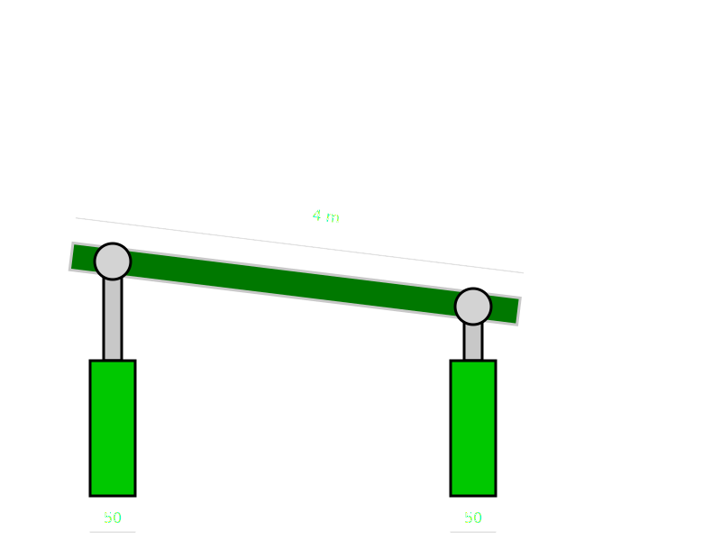

# Homework1: Livella

### Introduzione al dispositivo
La funzione del meccanismo è quella di regolare l'inclinazione di una piastra utilizzando due pistoni ad essa connessi.
Il pistone di sinistra è connesso alla piastra mediante una coppia rotoidale, mentre il pistone di destra tramite una coppia a camma che permette una traslazione relativa dei membri connessi.

Il device può essere utile nell'accoppiamento con un altro device per regolarne il posizionamento e l'inclinazione.

#### Procedura di utilizzo dell'eseguibile:
1. Attraverso il terminal si inseriscono i valori dei parametri, (qualora fossero negativi o nulli il programma chiede nuovamente di inserire il parametro);
2. Se i parametri non dovessero rispettare i vincoli costruttivi del dispositivo il programma specifica il problema e chide di reinserirli.
3. Vengono stampati i parametri del dispositivo;
4. Viene chiesto i inserire il nome del file .svg del file che verrà creato;
5. Si sceglie se aggiungere le misure al file svg;
6. In fine viene creato il file .svg;

#### Parametri fissi:
* Raggio delle coppie rotoidali: 20

#### Vincoli da rispettare:
* Non inserire parametri negativi
* La lunghezza del cilindro interno non deve eccedere quella del cilindro esterno
* La larghezza del cilindro interno non deve essere maggiore di quella del cilindro esterno
* La lunghezza della piastra non deve essere minore della distanza tra gli estremi dei cilindri
* Lo spessore della piastra non deve essere maggiore dell'altezza dei cilindri esterni
* I pistoni non devono intersecarsi

#### Parametri dei pistoni:
* `posx`: posizione x del cilindro esterno
* `posy`: posizione y del cilindro esterno
* `alt1`: altezza del cilindro esterno
* `larg1`: larghezza del cilindro esterno
* `alt2`: altezza del cilindro interno
* `larg2`: larghezza del cilindro interno

#### Parametri della piastra:
* `spess`: spessore della piastra
* `lungh`: lunghezza della piastra

